# Idea to production-ready agent in seconds on AI-native runtime

Production agents need more than a capable model: they need safe code execution, persistent workspaces, fast startup, and controlled access to other systems. This Microsoft Build session, presented on June 3, 2026 by Devanshi Joshi, Simon Jakesch, and Gopi Prashanth, brings those requirements together through Azure Container Apps, a voice-connected multi-agent application, and Auger's autonomous supply-chain platform. The notes below combine the supplied slides and Word transcript with timestamped captions from the [official recording](https://www.youtube.com/watch?v=4VPLRt25bec).

Availability and performance statements reflect the June 2026 session, not a current service guarantee. Watch links identify the relevant discussion rather than exact slide transitions. All 30 PDF pages are retained, including six repeated page pairs; repeated material is cross-referenced to avoid retelling it.

## Table of contents

- [An agent needs a production runtime](#an-agent-needs-a-production-runtime)
- [From runtime failures to a working application](#from-runtime-failures-to-a-working-application)
- [Project risk extends beyond model quality](#project-risk-extends-beyond-model-quality)
- [Runtime reliability is a separate engineering concern](#runtime-reliability-is-a-separate-engineering-concern)
- [Five ways an agent runtime can fail](#five-ways-an-agent-runtime-can-fail)
- [Restarts and fragmented tooling compound the cost](#restarts-and-fragmented-tooling-compound-the-cost)
- [Five capabilities define the runtime contract](#five-capabilities-define-the-runtime-contract)
- [Persistence and security belong in the runtime](#persistence-and-security-belong-in-the-runtime)
- [A voice-connected application combines three agents](#a-voice-connected-application-combines-three-agents)
- [Match each runtime need to a platform capability](#match-each-runtime-need-to-a-platform-capability)
- [Combine application hosting with ephemeral workspaces](#combine-application-hosting-with-ephemeral-workspaces)
- [Sandboxes provide isolated, stateful compute on demand](#sandboxes-provide-isolated-stateful-compute-on-demand)
- [Governed agent work and isolated student environments](#governed-agent-work-and-isolated-student-environments)
- [Six workload patterns fit sandbox execution](#six-workload-patterns-fit-sandbox-execution)
- [Auger applies agents to supply-chain coordination](#auger-applies-agents-to-supply-chain-coordination)
- [Supply-chain autonomy needs more than generated code](#supply-chain-autonomy-needs-more-than-generated-code)
- [Even a pen has a multi-tier supply chain](#even-a-pen-has-a-multi-tier-supply-chain)
- [A shared ontology and context anchor the agents](#a-shared-ontology-and-context-anchor-the-agents)
- [Bespoke data integration does not scale](#bespoke-data-integration-does-not-scale)
- [Agentic data integration combines discovery and approval](#agentic-data-integration-combines-discovery-and-approval)
- [Agents need a common world model](#agents-need-a-common-world-model)
- [AUSCO separates reasoning from deterministic operations](#ausco-separates-reasoning-from-deterministic-operations)
- [Context makes answers consistent and reusable](#context-makes-answers-consistent-and-reusable)
- [Retrieve context, route the task, and preserve provenance](#retrieve-context-route-the-task-and-preserve-provenance)
- [Four feedback loops improve the shared system](#four-feedback-loops-improve-the-shared-system)
- [Apps, Sandboxes, Express, and GPUs serve different roles](#apps-sandboxes-express-and-gpus-serve-different-roles)
- [Keep deployment evidence distinct from planned benefits](#keep-deployment-evidence-distinct-from-planned-benefits)
- [Product announcements and demo code](#product-announcements-and-demo-code)
- [Start with the right execution surface](#start-with-the-right-execution-surface)
- [Session resources and feedback](#session-resources-and-feedback)
- [Q&A](#qa)

## An agent needs a production runtime

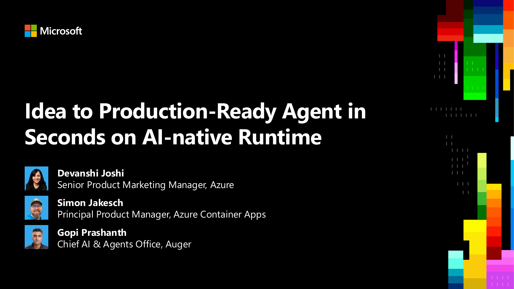
[Watch from 00:42](https://www.youtube.com/watch?v=4VPLRt25bec&t=42s)

An agent can reason correctly and still fail as a service. A tool call can damage its workspace, a restart can erase the state needed to continue, and provisioning delays can interrupt the interaction. The runtime has to support the full cycle of creating an agent, executing its work, hosting it, and observing it in production.

Azure Container Apps provides several parts of that runtime: applications and APIs, isolated sandbox workspaces, Express for fast application deployment, and serverless GPUs for model inference. These serve different purposes within the same system rather than requiring every workload to use the same execution environment.

## From runtime failures to a working application

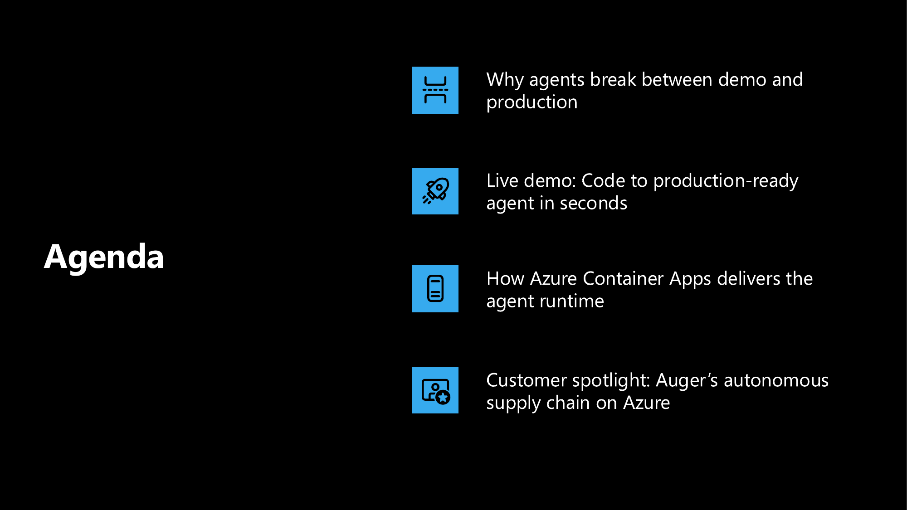
[Watch from 01:06](https://www.youtube.com/watch?v=4VPLRt25bec&t=66s)

The path to production starts with identifying what breaks outside the model: cost, execution safety, latency, state, and integration. A multi-agent voice application makes those requirements concrete, while Auger's supply-chain system adds long-running data integration and interactive reasoning at enterprise scale.

Infrastructure, code, deployment, and ongoing operation are linked decisions. Choosing an execution environment also determines how an agent reaches tools, what it can retain between tasks, and how much work the application must do to recover from interruptions.

## Project risk extends beyond model quality

[Watch from 02:04](https://www.youtube.com/watch?v=4VPLRt25bec&t=124s)

The June 2025 Gartner forecast cited here puts agentic AI project cancellations above 40% by 2027. This is a forecast, not a measured cancellation rate. Runtime reliability is the practical concern examined here; the forecast alone does not establish runtime failures as the sole cause of project cancellation.

A single bad tool call can force a workspace rebuild. Cold starts can delay repeated steps in the agent loop, and uncontrolled execution can expose data. Those risks remain even when the underlying model can perform the reasoning task.

## Runtime reliability is a separate engineering concern

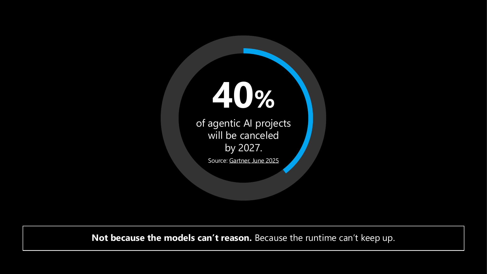
[Watch from 02:04](https://www.youtube.com/watch?v=4VPLRt25bec&t=124s)

Improving a prompt or switching models does not provide isolation, restore files, or shorten infrastructure provisioning. Those are execution-environment requirements. The [project-risk discussion](#project-risk-extends-beyond-model-quality) therefore leads to a distinct runtime design problem, not just another model-selection exercise.

## Five ways an agent runtime can fail

[Watch from 03:02](https://www.youtube.com/watch?v=4VPLRt25bec&t=182s)

Unattended loops can consume a large token budget before anyone notices. Generated code running on a developer's laptop can also reach credentials already present there, including SSH keys, browser cookies, and production credentials. A convenient development machine is not automatically a safe boundary for untrusted execution.

Latency and state loss create a second set of failures. Each provisioning delay interrupts the agent loop; each workspace restart can discard context, caches, and intermediate results. Long-running work becomes repeated setup work when the execution environment cannot preserve progress.

Finally, each runtime can bring its own configuration and packaging rules. Manually connecting tools, cloud services, and agent environments adds integration work that must survive the move from a local prototype to production.

## Restarts and fragmented tooling compound the cost

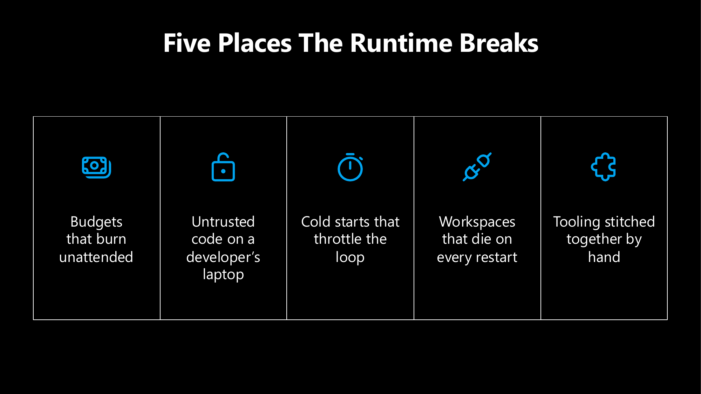
[Watch from 04:26](https://www.youtube.com/watch?v=4VPLRt25bec&t=266s)

The setup cost is not limited to compute startup. Losing a cache, intermediate file, or execution context means reconstructing earlier work before the agent can continue. Repeating that across a long task wastes time and can also trigger more model calls.

The [five runtime risks](#five-ways-an-agent-runtime-can-fail) need separate controls. Scaling idle compute to zero can reduce compute spending, but it does not itself stop a runaway token-consuming loop or make an overly broad tool permission safe.

## Five capabilities define the runtime contract

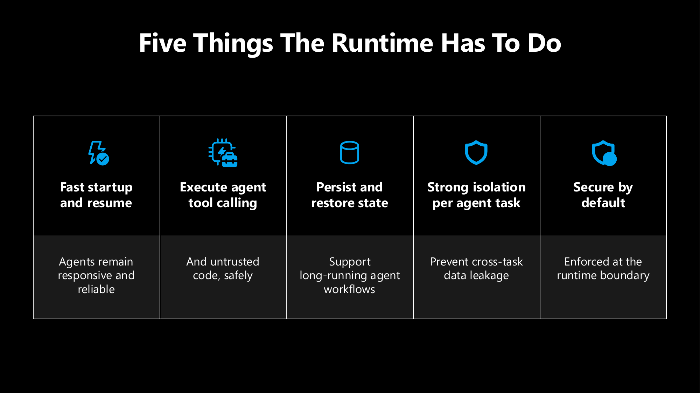
[Watch from 05:34](https://www.youtube.com/watch?v=4VPLRt25bec&t=334s)

Agents are event-driven: they wake, act, and become idle. Fast startup and resume keep that pattern responsive without requiring the workspace to run continuously. The session sets sub-second startup as a design expectation and cites under-100-millisecond startup as the desired performance level; that is not an end-to-end response-time guarantee for every agent task.

Tool calls need a safe execution path for APIs, generated code, and other cloud services. Persistent state must support work that lasts hours rather than forcing the agent to reconstruct its environment. Strong per-task isolation limits cross-task data exposure, while secure defaults enforce access controls at the runtime boundary.

## Persistence and security belong in the runtime

[Watch from 06:34](https://www.youtube.com/watch?v=4VPLRt25bec&t=394s)

Persistence preserves the context needed to continue a task, while isolation constrains what that task can affect. Both matter for an agent that sleeps during a human approval step and later resumes execution.

Security spans identity, data access, and the systems reached by tool calls. The [runtime contract](#five-capabilities-define-the-runtime-contract) places those controls at the execution boundary, rather than relying solely on application code or instructions telling the agent what not to do.

## A voice-connected application combines three agents

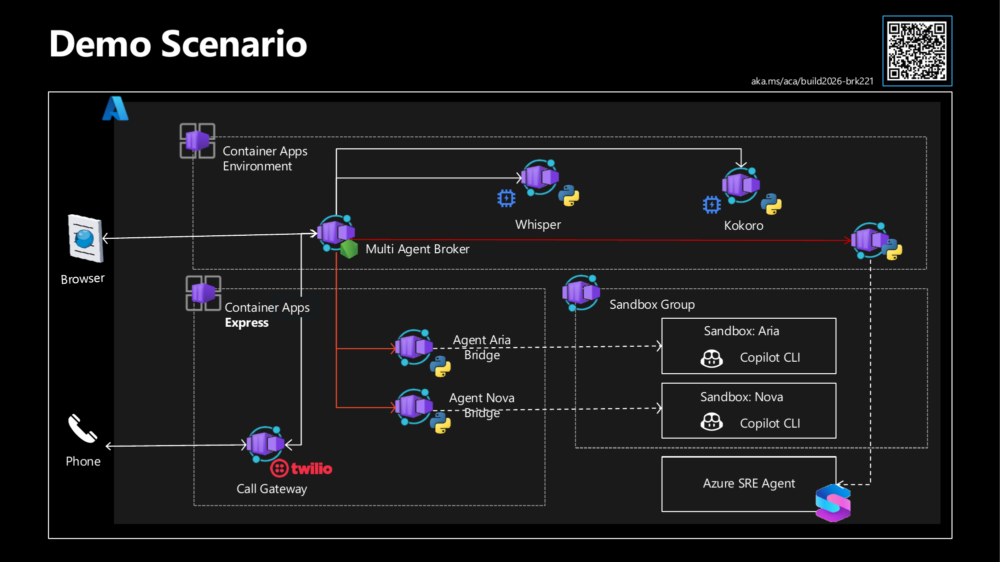
[Watch from 08:18](https://www.youtube.com/watch?v=4VPLRt25bec&t=498s)

The application separates the conversation interface from the agents that do the work. A multi-agent broker coordinates audio interactions with Whisper for speech-to-text and Kokoro for text-to-speech. Both speech models run on serverless GPUs in a Container Apps environment. Agent bridges connect the broker to Aria and Nova, each running Copilot CLI in its own sandbox, and to Azure SRE Agent. A browser provides direct voice interaction; a Twilio call gateway adds telephone access. The [demo repository](https://aka.ms/aca/build2026-brk221) contains the application code.

### Coding, personal assistance, and operations run independently

At [11:26](https://www.youtube.com/watch?v=4VPLRt25bec&t=686s), Aria receives a request to build a tic-tac-toe game and report its listening port. While that work runs, Nova retrieves Build-related calendar entries and the latest Teams message through configured connectors. SRE Agent describes the monitored application, including its Container Apps, Azure Container Registry, and Log Analytics infrastructure. Aria later reports that the game is running on port 80.

These are separate responsibilities with different tool access. The developer agent needs a writable execution environment, the personal assistant needs enterprise connectors, and the operations agent needs visibility into application infrastructure. Sharing a voice interface does not mean sharing every permission.

### GPU-backed speech services can scale to zero

At [14:44](https://www.youtube.com/watch?v=4VPLRt25bec&t=884s), the speech services run as containerized models on GPU workload profiles. The session lists T4 and A100 options and availability in 15 regions at that time. Serverless hosting lets the applications scale down when idle instead of keeping model-serving compute allocated continuously. Model startup and response latency are still distinct from sandbox startup.

### Sandbox groups supply common configuration

At [16:56](https://www.youtube.com/watch?v=4VPLRt25bec&t=1016s), a sandbox group organizes connectors, volumes, snapshots, and disk images. Sandboxes inherit group settings, avoiding repeated setup for every workspace. A newly created template-based sandbox can launch Copilot CLI with the GitHub authentication already configured for that group.

Inheritance makes the group a meaningful configuration boundary. Nova's calendar, email, and Teams access comes from its configured connectors, not from a model's inherent ability to reach those systems.

### Resume can preserve memory as well as disk

At [17:34](https://www.youtube.com/watch?v=4VPLRt25bec&t=1054s), a sleeping sandbox resumes a background script after roughly 20 to 25 minutes of inactivity. The script continues from its earlier execution state. Sandboxes can be configured to capture disk and memory, or disk alone, when sleeping.

The visible wake operation is described as taking about one or two seconds. That observation should not be confused with a measured under-100-millisecond cold start. Memory-preserving resume and restoring disk content also have different semantics: retaining files alone does not imply that every running process resumes from its previous instruction.

### Network rules constrain external access

At [20:25](https://www.youtube.com/watch?v=4VPLRt25bec&t=1225s), sandbox controls extend beyond process isolation to a layer-seven firewall. Rules govern allowed hosts and denied routes on those hosts. Connectors provide the intended service access, while network policy constrains which destinations and paths the sandbox can reach.

At [21:43](https://www.youtube.com/watch?v=4VPLRt25bec&t=1303s), exposing Aria's port 80 makes the generated game available in a browser. Running a server inside the workspace and exposing it to a user are separate steps; the port is explicitly added before the game is opened.

### Snapshots capture more than a Git commit

At [22:31](https://www.youtube.com/watch?v=4VPLRt25bec&t=1351s), a disk snapshot of Aria becomes the source for a new sandbox. The copied workspace retains the prior Copilot sessions. A full workspace snapshot captures state that may be absent from version control, giving an agent a restoration or branching point for work that needs to be undone and retried.

### Telephone access also needs correct agent routing

At [24:09](https://www.youtube.com/watch?v=4VPLRt25bec&t=1449s), the Twilio gateway connects a phone call to the agent system. SRE Agent returns details of the latest source-control check-in. A later request addressed to Nova to send an email is answered by SRE Agent, which says it cannot send email. The recording does not establish that an email was sent; voice connectivity alone does not ensure correct routing between agent roles.

## Match each runtime need to a platform capability

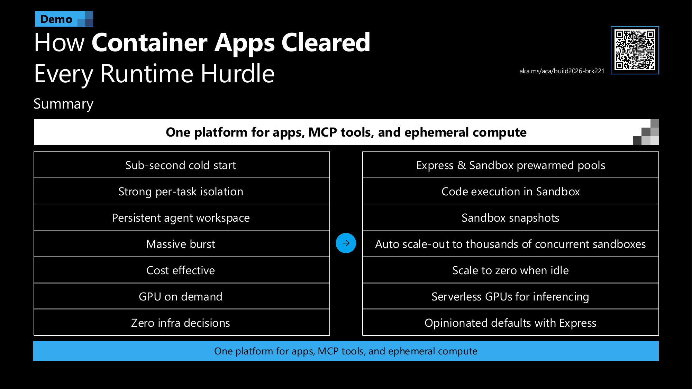
[Watch from 26:19](https://www.youtube.com/watch?v=4VPLRt25bec&t=1579s)

Prewarmed pools in Express and Sandboxes address startup latency. Sandbox execution provides per-task isolation, and snapshots preserve agent workspaces. Concurrent sandbox scale-out addresses bursts; scale-to-zero reduces idle compute use. Serverless GPUs host inference workloads, while Express provides defaults that reduce deployment decisions.

Together these capabilities support applications, MCP tools, and short-lived compute in one platform. The feature mapping includes claims of scaling to thousands of concurrent sandboxes; the recorded interaction is not a controlled benchmark proving that scale or a universal latency figure.

## Combine application hosting with ephemeral workspaces

[Watch from 26:49](https://www.youtube.com/watch?v=4VPLRt25bec&t=1609s)

An application endpoint and an agent's working environment have different lifecycles. A stable API can remain the interface while sandbox workspaces start, sleep, resume, or branch from snapshots beneath it. GPU-backed model services form another independently managed part of the system.

The [capability mapping](#match-each-runtime-need-to-a-platform-capability) ties those pieces together without treating a sandbox as the only hosting choice. Express supplies a fast application layer; Sandboxes supply isolated, stateful environments for agent work.

## Sandboxes provide isolated, stateful compute on demand

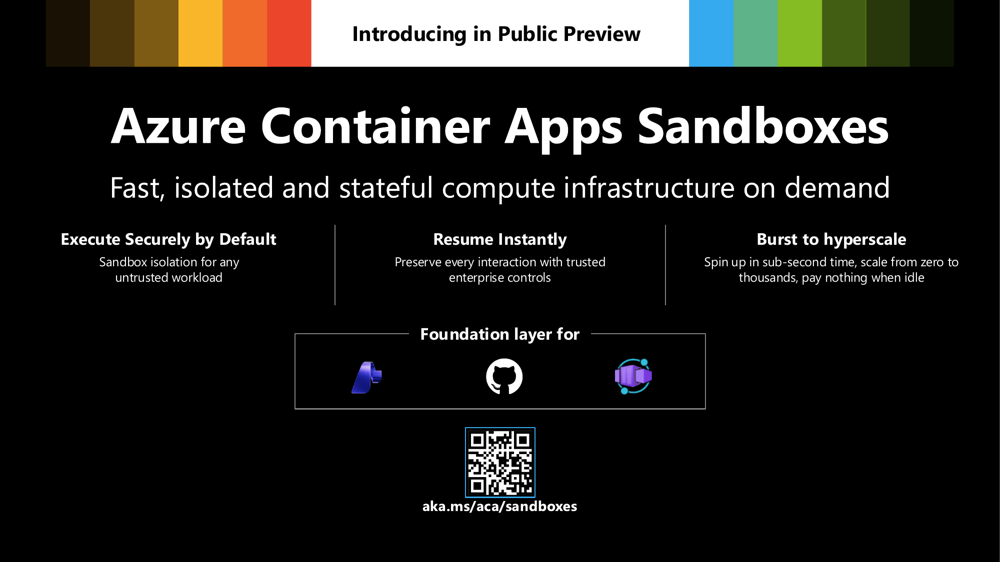
[Watch from 27:17](https://www.youtube.com/watch?v=4VPLRt25bec&t=1637s)

Azure Container Apps Sandboxes entered public preview at this session. The service combines isolated execution for untrusted workloads, preserved state, and rapid creation and scale-out. Generated code is one use case, but the same boundary can serve other untrusted or multi-tenant workloads.

The runtime also underpins other Microsoft experiences named in the session: GitHub Copilot cloud sandboxes, Foundry hosted agents, and Container Apps Express. Express uses this foundation for fast application hosting, including ordinary web applications and APIs. The [Sandboxes starting point](https://aka.ms/aca/sandboxes) provides product details and examples.

## Governed agent work and isolated student environments

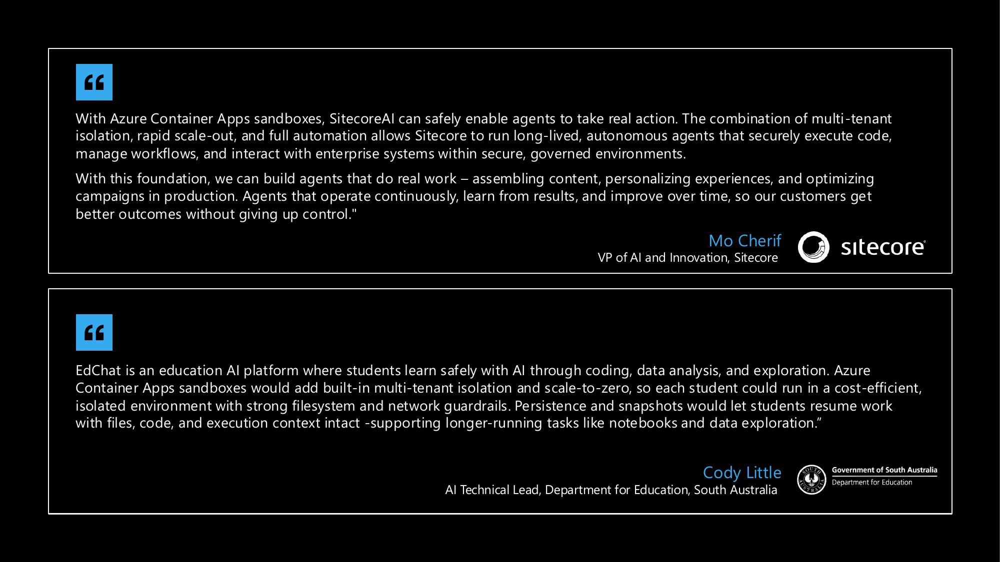
[Watch from 28:35](https://www.youtube.com/watch?v=4VPLRt25bec&t=1715s)

SitecoreAI's described use case is long-lived autonomous work inside governed environments: executing code, managing workflows, interacting with enterprise systems, assembling content, and personalizing campaigns. Multi-tenant isolation and rapid scale-out provide the execution foundation without requiring all tenants to share one workspace.

EdChat, from South Australia's Department for Education, applies a similar idea to learning. Each student could have an isolated environment for coding, notebooks, data analysis, and exploration, with filesystem and network controls. Persistence and snapshots would allow students to return to files and execution context later, while scale-to-zero would limit idle compute costs.

The EdChat quotation describes what Sandboxes **would** add. It is a proposed benefit, not evidence of a completed sandbox deployment. Neither quotation provides a measured performance result.

## Six workload patterns fit sandbox execution

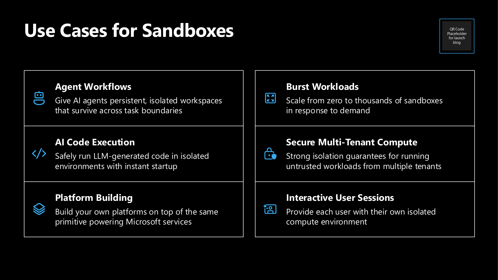
[Watch from 29:49](https://www.youtube.com/watch?v=4VPLRt25bec&t=1789s)

Agent workflows need persistent workspaces across task boundaries. AI code execution needs an isolated place to run generated code without exposing the production application's environment. Platform builders can use the same compute primitive to offer their own agent or copilot experiences.

Burst workloads need many workspaces on demand. Multi-tenant services need boundaries between untrusted workloads. Interactive applications can assign each user a separate compute session. Across all six patterns, the agent can be a consumer of the sandbox service: it requests an environment, performs work, and lets that environment become idle when the task no longer needs compute.

## Auger applies agents to supply-chain coordination

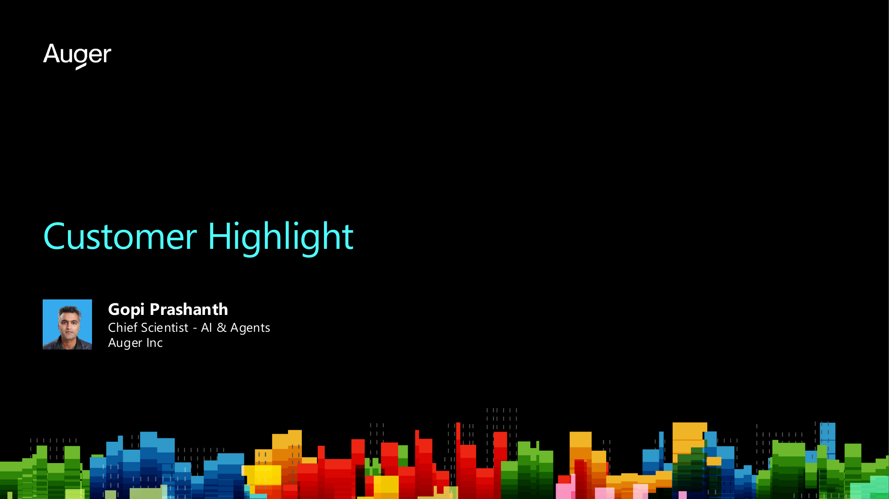
[Watch from 31:05](https://www.youtube.com/watch?v=4VPLRt25bec&t=1865s)

Auger builds autonomous supply-chain software around the coordination work between suppliers, factories, warehouses, transport providers, and customers. Its architecture combines agents with a common domain model rather than building a separate reasoning system for each customer's schema.

Gopi Prashanth, Chief Scientist for AI and Agents at Auger, provides the customer perspective. The central challenge is translating fragmented enterprise data and operating knowledge into decisions that can be reused across a complex supply chain.

## Supply-chain autonomy needs more than generated code

[Watch from 31:05](https://www.youtube.com/watch?v=4VPLRt25bec&t=1865s)

Code generation lowers the cost of building software, but domain coordination still requires shared meaning. Agents need to know how a supplier relates to an order, which business rules apply, and what a proposed action changes. That is the foundation for the [Auger architecture](#auger-applies-agents-to-supply-chain-coordination) developed in the following sections.

## Even a pen has a multi-tier supply chain

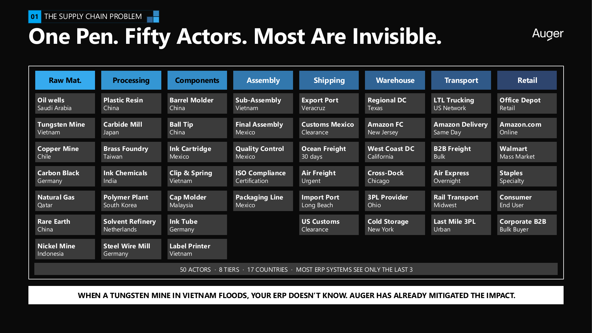
[Watch from 31:57](https://www.youtube.com/watch?v=4VPLRt25bec&t=1917s)

A pen connects raw materials, processing, component production, assembly, shipping, warehousing, transport, and retail. The illustrative chain spans 50 actors, eight tiers, and 17 countries. Oil, metals, ink ingredients, molded parts, packaging, and distribution all contribute dependencies before the finished product reaches its buyer.

Product variants multiply those dependencies: changing the ink, body, or writing mechanism changes the parts and processes required. More complex products extend the same coordination problem. Downstream enterprise records can miss upstream disruptions, such as a flooded mine affecting a material supplier. Auger's aim is to reason across that wider chain and reduce manual coordination; the mine-flood example is not a documented incident result.

## A shared ontology and context anchor the agents

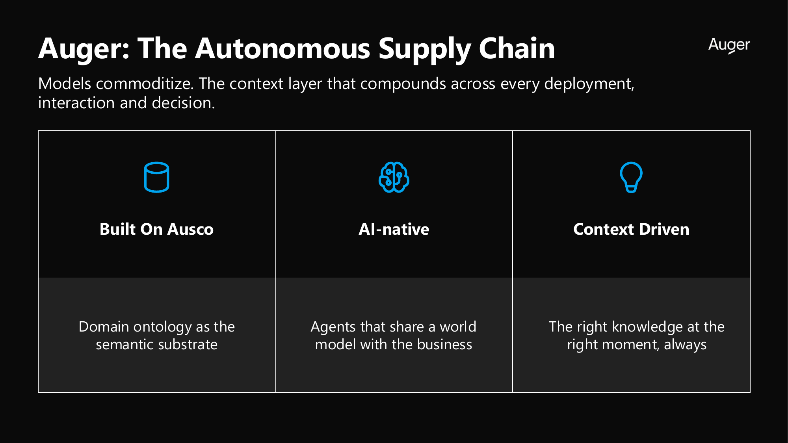
[Watch from 33:48](https://www.youtube.com/watch?v=4VPLRt25bec&t=2028s)

Auger's approach has three parts. AUSCO supplies a common supply-chain ontology. AI-native design means agents and application layers use the same domain language. Context brings in the knowledge needed for a particular customer, decision, or moment.

That context includes institutional knowledge accumulated by operators over decades, much of it neither documented nor public. A foundation model alone cannot supply it. The architecture therefore emphasizes how data and operating knowledge become usable, shared context rather than treating model selection as the whole solution.

## Bespoke data integration does not scale

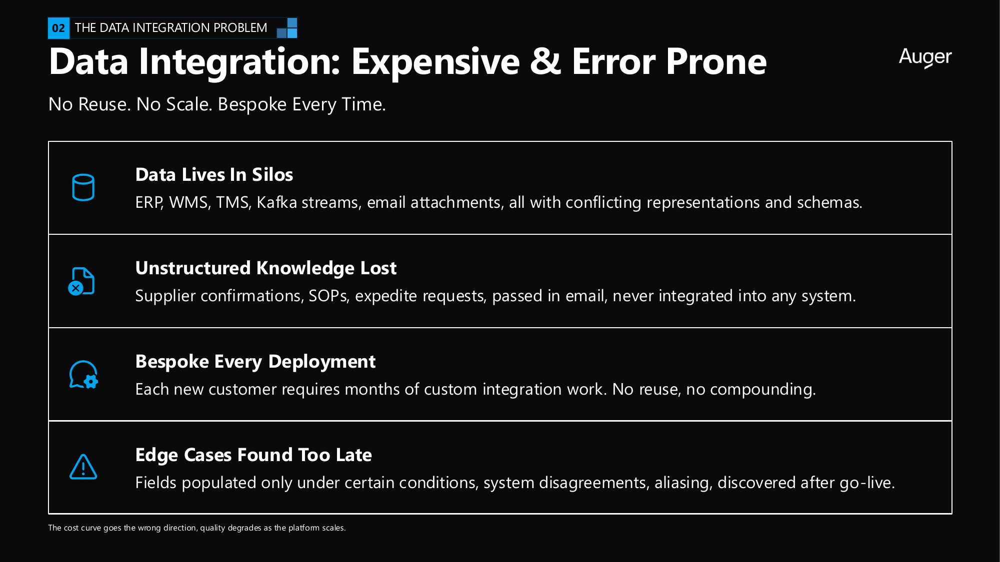
[Watch from 34:43](https://www.youtube.com/watch?v=4VPLRt25bec&t=2083s)

Supply-chain data is scattered across ERP, warehouse management, transport management, event streams, and email. The same business concept can have conflicting names and schemas. Supplier confirmations, standard operating procedures, and urgent requests may remain in unstructured messages instead of entering an operational system.

Custom integration for each deployment repeats the same effort. Conditional fields, inconsistent systems, and aliases often surface only after go-live. Solving the common cases first can leave most of the remaining work trapped in exceptions, preventing integration knowledge from carrying forward to the next customer.

## Agentic data integration combines discovery and approval

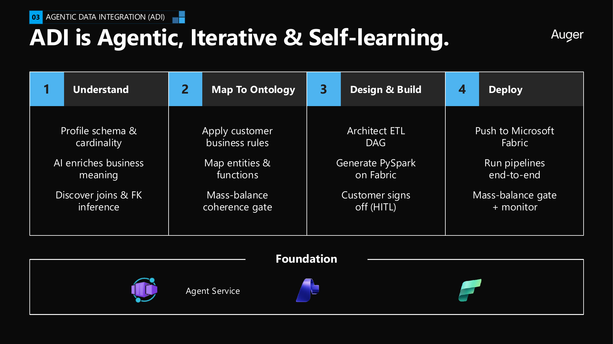
[Watch from 35:28](https://www.youtube.com/watch?v=4VPLRt25bec&t=2128s)

Agentic Data Integration, or ADI, starts by profiling schema and cardinality, enriching business meaning, and discovering joins and likely foreign-key relationships. Lower-level agents examine tables and columns; higher-level agents combine those findings to reason about relationships across the data estate.

Mapping connects the discovered entities and functions to the ontology and customer business rules. Mass-balance checks provide a coherence gate. The build stage creates an ETL dependency graph and PySpark work for Microsoft Fabric, with customer sign-off before deployment. Deployment then runs the pipelines end to end and applies mass-balance validation and monitoring.

The scale example is a Snowflake account with roughly 900 tables, more than a thousand columns per table, and millions of rows. Auger reports using thousands of agents on Container Apps to turn integration work that might take a year into work completed in days. That is a customer-reported outcome, not a general duration guarantee.

Human review is part of the workflow, not an exception to it. Long-running agents can sleep while waiting for approval or missing business information, then wake with that context and continue. Persistent execution environments support the waiting period without requiring the discovery work to begin again.

## Agents need a common world model

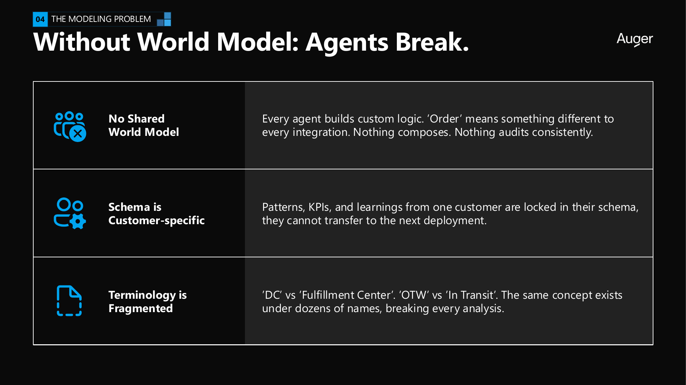
[Watch from 37:04](https://www.youtube.com/watch?v=4VPLRt25bec&t=2224s)

Without a shared model, every integration invents its own meaning for concepts such as an order. That makes functions hard to compose and results hard to audit consistently. Customer-specific schemas also trap useful KPI definitions and operational patterns inside one deployment.

Terminology differences make the problem worse. A distribution center and a fulfillment center can refer to the same concept; "OTW" and "in transit" can describe the same status. A reusable world model must resolve those aliases while preserving the language each customer uses.

## AUSCO separates reasoning from deterministic operations

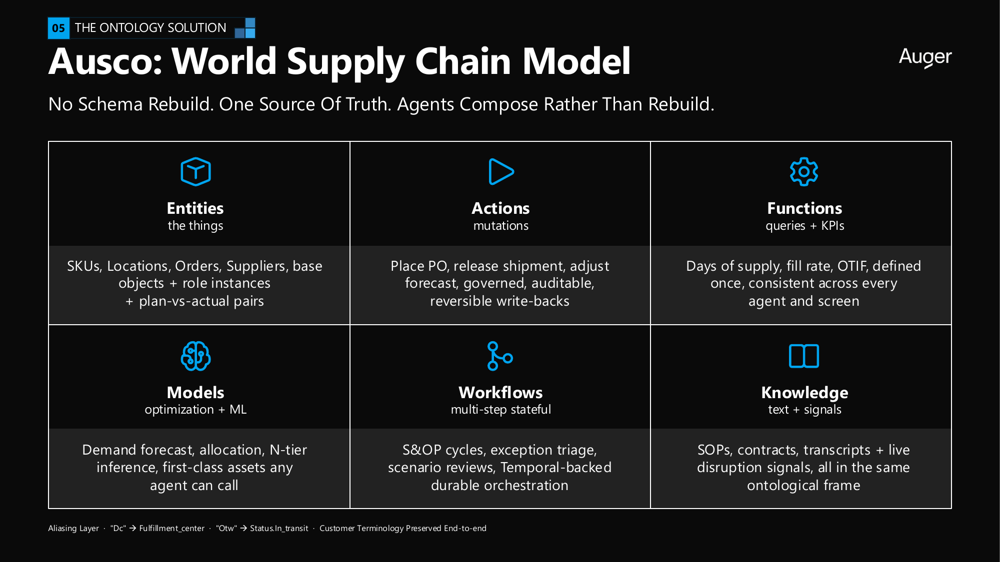
[Watch from 37:20](https://www.youtube.com/watch?v=4VPLRt25bec&t=2240s)

AUSCO is more than a data schema. It represents six kinds of domain objects: entities, actions, functions, models, workflows, and knowledge. Entities include SKUs, locations, orders, and suppliers, with roles and plan-versus-actual pairs. Actions include placing purchase orders, releasing shipments, and adjusting forecasts through governed, auditable changes.

Functions define queries and KPIs such as days of supply, fill rate, and on-time-in-full delivery consistently. Models make forecasting, allocation, and multi-tier inference callable assets. Workflows cover stateful processes such as sales and operations planning, exception triage, and scenario review, with Temporal-backed durable orchestration. Knowledge includes procedures, contracts, transcripts, and live disruption signals in the same domain frame.

Agents reason about decisions and choose operations; deterministic tools perform the well-defined calculations and mutations. That avoids asking a model to recreate arithmetic, business rules, or supply-chain behavior on each request. The aliasing layer maps customer terms into shared concepts without forcing every customer to rename its business.

ADI connects source data to this model by generating the ETL pipelines and machine-learning notebooks needed to make the data useful at the ontology layer. The shared target lets integration and reasoning build on each other.

## Context makes answers consistent and reusable

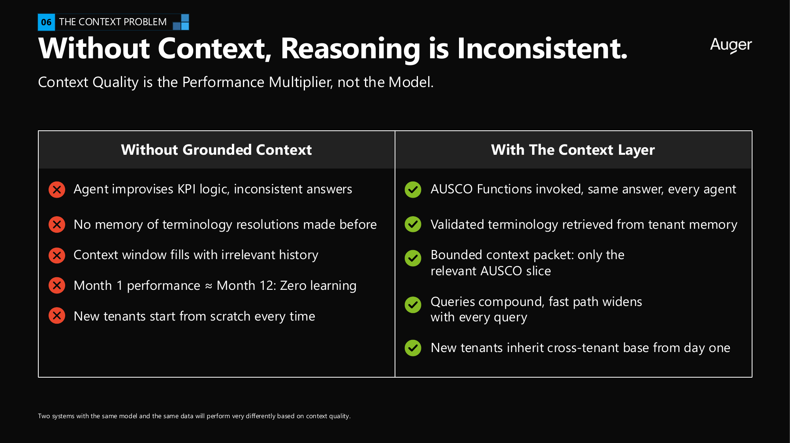
[Watch from 38:34](https://www.youtube.com/watch?v=4VPLRt25bec&t=2314s)

The same model and data can produce different results depending on context quality. Without grounding, an agent can improvise KPI logic, forget earlier terminology resolutions, and fill its context window with irrelevant history. A grounded context layer calls shared AUSCO functions and retrieves validated terminology from tenant memory.

Only the relevant part of AUSCO needs to enter a bounded context packet. Validated patterns can expand the set of known queries that follow a fast execution path. The architecture also proposes carrying reusable patterns forward to new tenants; the materials do not specify the privacy or sharing mechanisms for those cross-tenant patterns.

Business priorities belong in this context too. A customer may prioritize service for one customer tier over another. The agent needs that operating policy to evaluate a supply-chain decision, not just a list of inventory records.

## Retrieve context, route the task, and preserve provenance

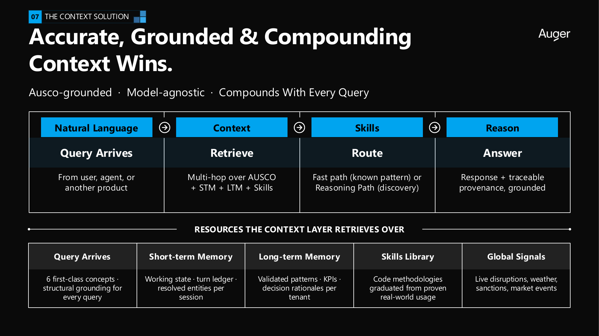
[Watch from 39:06](https://www.youtube.com/watch?v=4VPLRt25bec&t=2346s)

A query can arrive from a person, another agent, or another product. Retrieval gathers the relevant AUSCO concepts, short-term working state, long-term tenant memory, proven skills, and global signals. Known patterns take a fast path; new questions take a reasoning path. The answer includes traceable provenance rather than an unsupported conclusion.

Short-term memory holds the session's working state, turn history, and resolved entities. Long-term memory holds validated patterns, KPIs, and decision rationales for a tenant. Skills encode methods that have proved useful, while global signals add disruptions, weather, sanctions, and market events.

A question such as "What happens if I put a warehouse here?" requires a modeling and simulation pipeline. Agents identify inputs, set parameters, retrieve data, and delegate work. Auger describes that coordination happening on the order of ten seconds; the recording does not establish a ten-second bound for every full simulation. These interactive operations have different latency needs from the slower, long-running integration workflows in the background.

## Four feedback loops improve the shared system

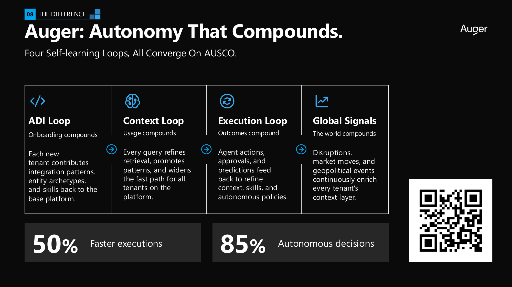
[Watch from 40:12](https://www.youtube.com/watch?v=4VPLRt25bec&t=2412s)

The ADI loop contributes integration patterns and entity archetypes. The context loop improves retrieval and promotes known patterns. The execution loop uses actions, approvals, and prediction outcomes to refine skills and policies. Global signals add new information about disruptions and market conditions. All four feed the AUSCO-based system.

Auger's accompanying figures are 50% faster executions and 85% autonomous decisions. No baseline, measurement method, or scope is provided, so these remain customer-reported figures rather than independently validated benchmarks.

The recorded deployment account adds operational scale: development began in March 2025, with two publicly disclosed customers by the session, more than 40 services on Container Apps, and thousands of agents running day to day. The combination supports both long-running backend work and fast user-facing reasoning.

## Apps, Sandboxes, Express, and GPUs serve different roles

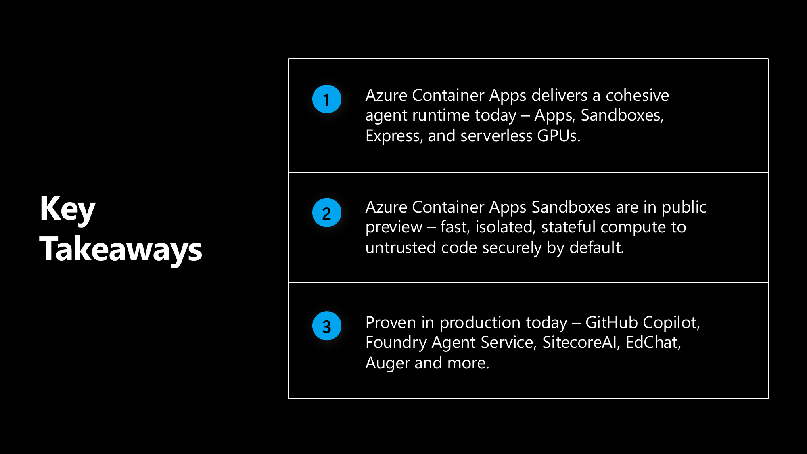
[Watch from 40:56](https://www.youtube.com/watch?v=4VPLRt25bec&t=2456s)

Azure Container Apps brings application hosting, agent workspaces, fast deployment, and model-serving compute into a connected runtime. Sandboxes supply isolated, stateful execution for untrusted work; Express supplies an application deployment experience; serverless GPUs support inference.

Sandboxes were in public preview as of this session. Microsoft also identified its own GitHub and Foundry experiences as users of the underlying runtime. Those adoption examples establish the intended breadth of the platform, not identical maturity or feature availability across every named service and customer.

## Keep deployment evidence distinct from planned benefits

[Watch from 41:20](https://www.youtube.com/watch?v=4VPLRt25bec&t=2480s)

The [combined runtime](#apps-sandboxes-express-and-gpus-serve-different-roles) has both Microsoft service integrations and customer use cases. Their evidence differs: Auger gives deployment scale, SitecoreAI describes governed agent capabilities, and EdChat's quotation describes prospective sandbox benefits. A broad production-adoption message should not turn those distinct accounts into a claim that every named example has the same deployed feature set.

## Product announcements and demo code

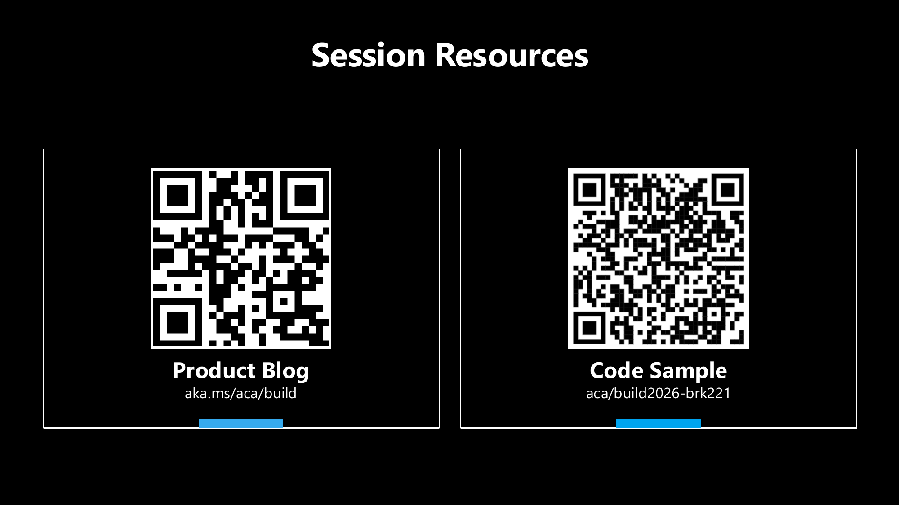
[Watch from 41:46](https://www.youtube.com/watch?v=4VPLRt25bec&t=2506s)

The [Container Apps Build product blog](https://aka.ms/aca/build) collects the announcements. The [BRK221 code sample](https://aka.ms/aca/build2026-brk221) is the starting point for the voice-connected application, including its agent integrations and hosting components. The complete code URL is printed earlier in the architecture and runtime recap material.

## Start with the right execution surface

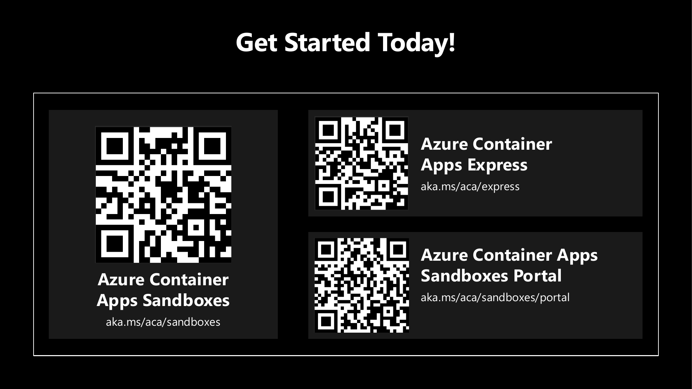
[Watch from 42:00](https://www.youtube.com/watch?v=4VPLRt25bec&t=2520s)

Use [Azure Container Apps Sandboxes](https://aka.ms/aca/sandboxes) for isolated agent workspaces and code execution. Use [Container Apps Express](https://aka.ms/aca/express) for the application being deployed. The [Sandboxes Portal](https://aka.ms/aca/sandboxes/portal) provides direct access to the sandbox management experience.

These are complementary choices: an agent can develop and test inside a sandbox, while its resulting web application or API is deployed through an application-hosting surface.

## Session resources and feedback

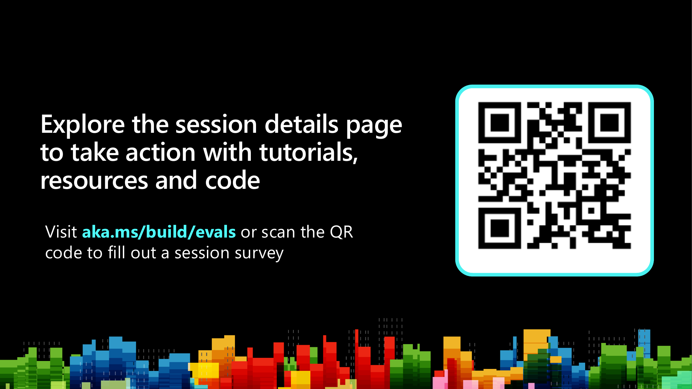
[Watch from 45:16](https://www.youtube.com/watch?v=4VPLRt25bec&t=2716s)

The [Build session page](https://build.microsoft.com/en-US/sessions/BRK221) provides the recording, slides, transcript, and related resources. Session feedback is available through the [Build evaluation form](https://aka.ms/build/evals). The closing timestamp points to the recorded sign-off; no separate technical explanation accompanies the evaluation material.

## Q&A

### Where is the code sample?

[Watch from 42:30](https://www.youtube.com/watch?v=4VPLRt25bec&t=2550s)

The audience request was to return to the code resources. The [BRK221 repository link](https://aka.ms/aca/build2026-brk221) provides the multi-agent application, and the [product blog](https://aka.ms/aca/build) supplies the announcement context.

### When should I use Express rather than Sandboxes?

[Watch from 42:54](https://www.youtube.com/watch?v=4VPLRt25bec&t=2574s)

Sandboxes are fast iteration environments that can both run agents and be used by agents. They provide the working environment for code execution, development, and resumable tasks. Their individual sessions can be transient even when state is preserved for later use.

Express is a fast deployment target for applications, especially web apps. Its environment-less experience removes the need to manage a Container Apps environment as a separate deployment concern; that does not mean no physical infrastructure exists. The practical distinction is to develop or execute agent work in Sandboxes and deploy the resulting application to Express where appropriate.

### Is AUSCO a document, an agent, or executable code?

[Watch from 44:26](https://www.youtube.com/watch?v=4VPLRt25bec&t=2666s)

AUSCO is an object-oriented representation in Auger's codebase, not merely a Markdown document or another agent. Data schemas, objects, common functions, and agents are registered with it. It represents how the supply chain operates as well as what data it contains.

The design keeps as much behavior deterministic as possible. Agents reason and decide which operations to use, while registered functions and domain objects provide consistent execution semantics.
